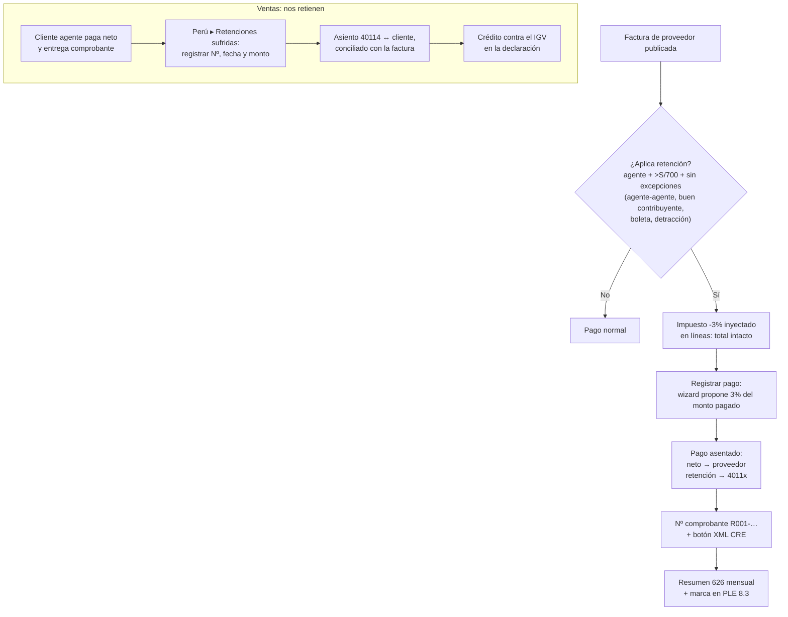

[← Índice de la app Perú](../../al_l10n_pe_ple/docs/README.md)

# Retenciones del IGV (Régimen de Retenciones — R.S. 037-2002/SUNAT)

**Menú:** Perú ▸ **Retenciones IGV** · **Módulo:** `al_l10n_pe_retention`.

**Qué es:** los **agentes de retención** designados por SUNAT retienen el
**3%** del importe total al pagar a sus proveedores (operaciones gravadas
> **S/ 700**), entregan un comprobante de retención y declaran con el
formulario 626. El proveedor retenido usa ese monto como crédito contra su
IGV. La retención se efectúa **en cada pago** (parciales incluidos).

## Diagrama de flujo

## Configuración inicial

1. **Ajustes ▸ Perú ▸ «Agente de retención del IGV»**: activar y revisar
   tasa (3 %) y mínimo (S/ 700).
2. **Impuesto de retención IGV**: impuesto de compras **negativo (-3 %)**
   marcado como *retención en el pago* (marco nativo de Odoo), con su
   cuenta 4011x «IGV – Retenciones por pagar» y una **secuencia**
   (`R001-########`) que numera los comprobantes. El script
   [`tools/retention_demo_data.py`](../tools/retention_demo_data.py) lo
   crea como referencia.
3. **Contactos**: «Agente de retención» y «Buen contribuyente» los
   mantiene `l10n_pe_vat_sunat` contra el padrón oficial de SUNAT; el
   proveedor que tenga cualquiera de las dos queda exceptuado. Son
   editables por si el padrón va por detrás de la designación.
4. Para **retenciones sufridas**: cuenta 40114 y diario en Ajustes ▸ Perú
   ▸ «Retenciones sufridas».

## Flujo del agente (compras)

1. La factura de proveedor que califica muestra «Sujeta a retención de
   IGV» y la retención estimada (excepciones automáticas: mínimo,
   agente-agente, buen contribuyente, boleta, operación con detracción).
2. Al publicarla, el impuesto de retención se añade a las líneas **sin
   alterar el total** (así lo maneja el marco nativo).
3. Al **Registrar pago**, el wizard propone la línea de retención con el
   **3 % del monto pagado** (en parciales, 3 % de cada cuota, editable).
   El pago asienta el neto al proveedor y la retención a la cuenta 4011x.
4. El pago recibe el **número de comprobante** (secuencia R001-…); el
   botón **XML CRE** genera el XML UBL del Comprobante de Retención
   Electrónico (borrador sin firma: la firma/envío corren por el OSE).
5. Menú **Retenciones efectuadas**: todos los pagos con retención.

## Flujo del proveedor retenido (ventas)

**Perú ▸ Retenciones IGV ▸ Retenciones sufridas**: registrar el
comprobante recibido del cliente agente (número, fecha, factura, monto —
propuesto al 3 %). Al **Registrar** se genera el asiento (cuenta 40114
contra el cliente) conciliado con la factura: el saldo por cobrar baja y
el crédito de IGV queda acumulado en la 40114.

## Declaración y reportes

- **Resumen 626**: TXT mensual con una línea por retención efectuada
  (RUC y razón social del proveedor, comprobante pagado, fecha y monto
  del pago, nº de comprobante de retención, monto retenido) — soporte
  para el F.V. 626.
- **PLE 8.3**: las compras sujetas a retención salen con la **marca de
  retención** (campo 26) en el Registro de Compras Simplificado.

## Errores comunes

| Situación | Causa / solución |
|---|---|
| «…falta configurar el Impuesto de retención IGV…» al publicar | La compañía es agente pero no eligió el impuesto en Ajustes ▸ Perú. |
| El wizard de pago no propone la retención | La factura no aplica (revisar excepciones) o se publicó antes de configurar el impuesto: pasar a borrador y republicar. |
| Retención sufrida sin cuenta | Configurar la cuenta 40114 en Ajustes ▸ Perú. |
