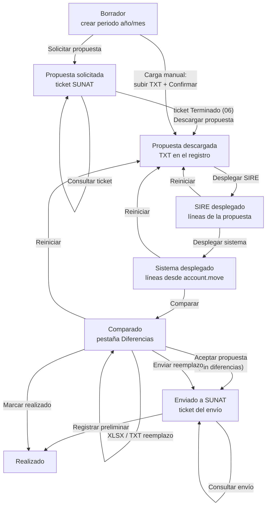

# SIRE — conciliación de RVIE y RCE

## Configuración

**Ajustes → Perú → sección SIRE (RVIE / RCE):**

| Campo | Origen |
| --- | --- |
| Usuario SOL (SIRE) | Usuario secundario SOL con permisos SIRE (el sistema envía `RUC+usuario`) |
| Clave SOL (SIRE) | Clave del usuario secundario |
| Client ID / Client Secret | SOL → Empresas → Credenciales de API SUNAT (aplicación con scope SIRE) |

Sin credenciales solo funciona la **carga manual** (subir el TXT exportado
desde SOL); todos los pasos posteriores son idénticos.

## Flujo completo

1. **Solicitar propuesta** — pide a SUNAT la exportación del periodo; devuelve
   un ticket asíncrono.
2. **Consultar ticket** — refresca el estado (`Solicitado`, `En proceso`,
   `Terminado`…). Con estado *Terminado* aparece **Descargar propuesta**.
3. **Desplegar SIRE** — parsea el TXT (RVIE 40 columnas, RCE 41+) y llena la
   pestaña *SIRE*.
4. **Desplegar sistema** — busca en Odoo las facturas del periodo
   (RVIE: `out_invoice/out_refund` por fecha de emisión, excluye notas de
   venta; RCE: `in_invoice/in_refund` por fecha contable, excluye recibos por
   honorarios) y construye las mismas columnas.
5. **Comparar** — cruza ambos lados por CAR SUNAT y marca cada línea:
   *Correcto / No cuadran / Solo en SIRE / Solo en Sistema*. La columna
   **Diferencias** lista *todos* los campos discrepantes con ambos valores.
6. **Exportables** — `XLSX` (hojas SIRE y Sistema con el layout SUNAT) y
   `TXT de reemplazo` (archivo de importación oficial, ZIP con nombre
   `LE<RUC><periodo>00<libro>021112.zip`, libro 140400/080400) para cargarlo
   en SOL si se prefiere hacerlo a mano.
7. **Aceptar propuesta** — da por buena la propuesta de SUNAT. Solo se permite
   si la comparación no encontró diferencias: aceptar con líneas que no cuadran
   sería declarar algo que el propio sistema dice que está mal.
8. **Enviar reemplazo** — sube el mismo ZIP del paso 6 por la API (carga TUS)
   con los códigos del Anexo I: `codProceso` 3 (RVIE) o 61 (RCE), `codLibro`
   140000/080000. Devuelve un ticket.
9. **Consultar envío** — estado del ticket del envío.
10. **Registrar preliminar** — deja el preliminar registrado en SUNAT y cierra
    el periodo en Odoo.

Los pasos 7 y 8 son **excluyentes** y solo se admite uno por periodo; un segundo
intento se rechaza mostrando el ticket del primero. Después de enviar, *Reiniciar*
queda bloqueado: rehacer las líneas no deshace lo declarado.

## Cómo se construyen los importes del sistema

- Bases por afectación IGV del primer impuesto de cada línea de producto
  (catálogo 07): gravada (10/17), exonerada (20/21), inafecta (30-37),
  exportación (40); gratuitas por código de tributo 9996.
- IGV/ISC/ICBPER desde las líneas de impuesto del asiento por grupo fiscal;
  el resto va a «Otros tributos».
- Importes en soles con el tipo de cambio implícito del asiento
  (`amount_total_signed / amount_total`, 3 decimales; vacío si el documento
  está en PEN). Notas de crédito con signo negativo; anuladas en 0 con
  estado `2 - Anulado`.
- **RVIE**: una NC cuyo comprobante modificado es de un periodo anterior
  lleva base e IGV a las columnas de **descuento** (`Dscto BI`, `Dscto IGV`).
- **RCE**: la columna *Clasif de Bss y Sss* sale del campo «Clasificación de
  bienes y servicios» de la factura de proveedor (pestaña Otra información,
  Tabla 30); *Detracción* se marca si la factura tiene detracción
  (módulo `al_l10n_pe_detraction`).

## Campos de comparación

**Perú → Configuración → SIRE: campos de comparación** (solo administradores
contables). Cada registro activa una columna del cruce; la secuencia ordena el
detalle de diferencias. Por defecto se comparan fechas, tipo/serie/número,
documento del socio, importes y estado; quedan desactivados (archivados) los
campos ruidosos: razón social, tipo de cambio, fecha de vencimiento, etc.
Para activarlos: filtro *Archivados* → botón *Desarchivar*.

## Limitaciones actuales

- La **generación del registro** se hace en el portal de SUNAT: no existe
  servicio web para ejecutarla desde fuera. El módulo llega hasta registrar el
  preliminar.
- No cubre el **complemento** de la propuesta (solo aceptación y reemplazo),
  el RCE de **No Domiciliados** (libro 080500) ni los **ajustes posteriores**.
- La carga por API sigue los manuales oficiales de servicios web (Compras v22 y
  Ventas v22) y los tests fijan los metadatos exactos, pero **no ha podido
  probarse contra el servicio real** por falta de credenciales de producción:
  conviene estrenarla con un periodo de prueba y comprobar el ticket en SOL.
