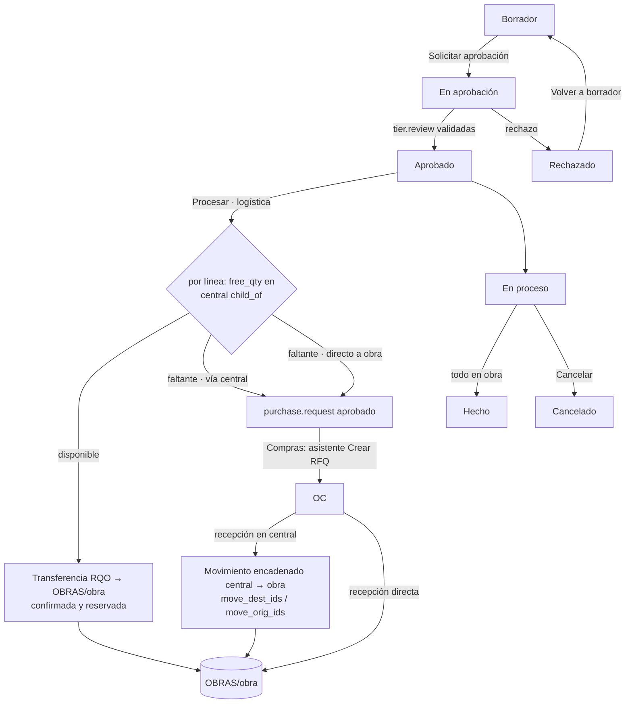

# Plan de desarrollo — `al_construction_material_request`

> Requerimiento de materiales de obra (CREVAL S.A.C.) para Odoo 19: el
> personal de obra pide, se aprueba por niveles (`base_tier_validation`),
> lo disponible sale del almacén central por transferencia interna y el
> faltante va a `purchase_request` (OCA).
> Fecha: 2026-09-30 · Branch: `19.0` · Base de pruebas local: `ol_pe_v19`
> (`cfg/my/pe.cfg`). El destino final es Odoo.sh `democonstruccion`: todo lo
> verificado aquí debe revalidarse allí (F6).

Marcas: **[Verificado]** en código 19.0 o en la base · **[Propuesta]** ·
**[Por validar]** con Vicente.

---

## F0 — Inventario (HECHO, pendiente de validación)

### F0.1 Módulos instalados en `ol_pe_v19` [Verificado, `ir_module_module`]

| Módulo | Versión | Nota |
|---|---|---|
| `stock` / `stock_account` | 19.0.1.1 | |
| `purchase` / `purchase_stock` | 19.0.1.2 | |
| `project` / `project_account` / `project_enterprise` | 19.0.1.3 / 1.0 / 1.0 | |
| `project_stock` (core) | 19.0.1.0 | añade `stock.picking.project_id` |
| `project_stock_account` (core) | 19.0.1.0 | analítica del proyecto en transferencias (ver F0.4) |
| `project_purchase` | 19.0.1.0 | |
| `analytic` | 19.0.1.2 | |
| `l10n_pe_edi_stock` (EE, GRE nativa) | 19.0.0.1 | motivo `04` «traslado entre establecimientos» existe |
| `al_l10n_pe_delivery_guide_report` | 19.0.7.20260828 | PDF de la guía |
| `al_hr_pe_construction` | 19.0.12.20260925 | planilla de construcción civil (sin relación directa) |
| `purchase_request` | — | **NO instalado** |
| `base_tier_validation` | — | **NO existe en el árbol** |

Datos de la base: 1 almacén (`ACL`), única ubicación interna
`ACL/Existencias`; planes analíticos raíz: `Project` y `DEMO TC Centros`
(**no hay** planes «disciplina» ni «partida»).

### F0.2 Dependencias OCA disponibles en `~/odoo/ce19/apps`

| Ref | Módulo | Dónde | Estado |
|---|---|---|---|
| R1 | `purchase_request` 19.0.1.0.2 (LGPL-3) | `apps/oca/purchase-workflow` (rama 19.0, `a4e76a5`, 28/08/2026) | presente, **fuera del `addons_path` de `pe.cfg`** |
| R2 | `base_tier_validation` 19.0.1.3.1 (**AGPL-3**, depende de `mail`) | no clonado. `OCA/tier-validation` rama 19.0 existe en GitHub (`0b611d7`) | **falta** |
| R3 | `purchase_request_tier_validation` | viene con `OCA/tier-validation` | **falta** |
| R4/R5 | `stock_request`, `stock_request_purchase` 19.0 | `apps/oca/stock-logistics-request` | presente; solo referencia de diseño (D1) |
| R6 | `stock_mts_mto_rule` | no hay 19.0 en `apps/oca/stock-logistics-warehouse` | — |
| — | Cybro `purchase_requisition_project_task`, `employee_purchase_requisition` | `apps/all/CybroAddons` | descartados: dependen de `purchase_requisition` (EE) / `hr` y generan OC directas |

### F0.3 Verificación en código fuente 19.0

- **`purchase.request.line.move_dest_ids`** (One2many a `stock.move` vía
  `created_purchase_request_line_id`) y el asistente «Crear RFQ» los copia a
  `purchase.order.line.move_dest_ids`
  (`wizard/purchase_request_line_make_purchase_order.py:172,252`).
  ⇒ la recepción de la OC se **encadena nativamente** con un movimiento
  central → obra que dejemos esperando: es la base natural de la opción (a)
  de §6.4 y resuelve la condición de carrera en la recepción (el movimiento
  encadenado reserva lo que llega por `move_orig_ids`).
- `purchase.request.line` hereda `analytic.mixin` y el asistente propaga
  `analytic_distribution` a la línea de OC (`wizard/...:169`).
- Estados de `purchase.request`: `draft / to_approve / approved /
  in_progress / done / rejected` (`models/purchase_request.py:7`).
- **R7 / D4**: en 19.0 `mts_else_mto` **sí divide**:
  `stock.move._prepare_procurement_qty` (`stock/models/stock_move.py:1787`)
  abastece solo `product_qty − free_qty`. La justificación de D4 del
  documento está desactualizada para 19.0, pero **D4 se mantiene**: la regla
  nativa genera OC (o PR solo si el producto tiene el check
  `purchase_request`), no da la foto de disponibilidad, ni un PR único por
  requerimiento, ni la nota de división en el chatter.
- **Analítica en movimientos** (criterio de aceptación 6):
  - `stock.move` **no tiene** campo `analytic_distribution` en 19.0;
    `stock_account` devuelve `{}` en `_get_analytic_distribution`
    (`stock_account/models/stock_move.py:255`).
  - `project_stock_account` usa la distribución **del proyecto** del
    picking si el tipo de operación tiene `analytic_costs`
    (`project_stock_account/models/stock_move.py:11`): no hay disciplina ni
    partida por línea.
  - Las líneas analíticas solo se crean para movimientos que entran o salen
    de la compañía (`stock_account/models/stock_move.py:190`,
    `moves_in | moves_out`). **Un traslado central → obra (interno →
    interno) no genera asiento ni analítica.** La analítica solo se
    materializará en el consumo en obra (fuera de alcance).
  - ⇒ Brecha documentada. Propuesta: campo `analytic_distribution` propio en
    `stock.move` (trazabilidad) que se usará cuando se implemente el consumo.
- **GRE**: `l10n_pe_edi_stock` (EE) instalado; el motivo `04` existe
  (`ee19/l10n_pe_edi_stock/models/stock_picking.py:26`). El módulo solo
  dejará la transferencia lista (motivo 04 por defecto) si está instalado.

### F0.4 Bloqueos para arrancar F2

1. Añadir `apps/oca/purchase-workflow` y `apps/oca/tier-validation` al
   `addons_path` de `cfg/my/pe.cfg` (y en `democonstruccion`, submódulo
   `OCA/tier-validation`).
2. Clonar `OCA/tier-validation` rama 19.0 en `apps/oca/tier-validation`
   (lo recoge `pull_all_19.sh`).
3. Instalar `purchase_request` y `base_tier_validation` en `ol_pe_v19`.
4. **Licencia**: la línea AL usa `OPL-1`, pero `base_tier_validation` es
   **AGPL-3**. Un módulo propietario que hereda `tier.validation` no es
   compatible. Opciones: AGPL-3 o LGPL-3 (esta última, compatible al
   combinarse con AGPL).

### F0.5 Resuelto con Vicente (30/09/2026)

- Licencia **LGPL-3** (compatible con `base_tier_validation` AGPL-3).
- Entorno preparado: `OCA/tier-validation` 19.0 clonado en
  `apps/oca/tier-validation`; `apps/oca/purchase-workflow` y
  `apps/oca/tier-validation` añadidos al `addons_path` de `cfg/my/pe.cfg`;
  `purchase_request` 19.0.1.0.2 y `base_tier_validation` 19.0.1.3.1
  instalados en `ol_pe_v19`.
- Recepción de lo comprado: **(c)**, por línea; por defecto (a).
- «Procesar»: **botón de logística**.

---

## F1 — Diseño (PROPUESTA, pendiente de validación)

### F1.1 Flujo

### F1.2 Modelo de datos definitivo

**`construction.material.request`**, que hereda `mail.thread`,
`mail.activity.mixin`, `tier.validation` y `analytic.mixin` (distribución
por defecto para las líneas):

| Campo | Tipo | Nota |
|---|---|---|
| `name` | Char | secuencia `RQO/%(year)s/#####` [Propuesta] |
| `state` | Selection | `draft, to_approve, approved, rejected, in_progress, done, cancel` |
| `project_id` | M2o `project.project` | obligatorio, `check_company` |
| `project_manager_id` | related `project_id.user_id` (store) | revisor del nivel 1 (`review_type='field'`) |
| `location_src_id` | M2o `stock.location` | por defecto desde Ajustes (existencias del central) |
| `location_dest_id` | M2o `stock.location` | desde `project_id.construction_location_id`; editable solo por Logística |
| `task_id` | M2o `project.task` | dominio `project_id` |
| `requested_by` | M2o `res.users` | por defecto el usuario actual |
| `date_request` / `date_required` | Date | |
| `priority` | Selection `0/1` | normal/urgente (widget `priority`) |
| `amount_estimated` | Monetary (store) | Σ `product_qty` × `standard_price` convertido a la UdM del producto; se usa en el dominio del nivel 2 |
| `line_ids` | O2m | |
| `picking_ids`, `purchase_request_ids`, `purchase_order_ids` | computados + contadores | botones inteligentes |
| `company_id`, `currency_id`, `note` | | multicompañía |

**`construction.material.request.line`** (`analytic.mixin`):

| Campo | Nota |
|---|---|
| `product_id` | dominio `type = 'consu'` (en 19.0 almacenable = `consu` + `is_storable`) |
| `product_uom_id`, `product_qty` | la UdM debe pertenecer a la categoría del producto |
| `task_id` | opcional, por defecto el del encabezado |
| `supply_mode` | `central` (por defecto) / `direct`: cómo llega lo que se compra (decisión (c)) |
| `qty_available_now` | no almacenado: `free_qty` actual en el origen `child_of`, en la UdM de la línea (lo que ve el solicitante) |
| `qty_available_at_approval` | foto al procesar (auditoría) |
| `qty_to_dispatch`, `qty_to_purchase` | resultado de la división |
| `qty_dispatched` | Σ movimientos central → obra hechos |
| `qty_purchased` | desde `purchase_request_line_ids.purchased_qty` |
| `qty_received_on_site` | Σ movimientos `done` con destino `child_of` la ubicación de obra (traslados + recepciones directas) |
| `move_ids`, `purchase_request_line_ids` | trazabilidad |
| `line_state` | `pending / partial / dispatched / purchasing / done / cancel` |

**Extensiones**

- `project.project`: `is_construction_site` (Bool) y
  `construction_location_id` (M2o `stock.location`), además de un botón
  inteligente de requerimientos.
- `project.task`: botón inteligente de requerimientos.
- `stock.move`: `construction_request_line_id` y `analytic_distribution`
  (`analytic.mixin`). Esta última **solo como trazabilidad**: el traslado
  interno no genera analítica en 19.0 (F0.3).
- `purchase.request`: `construction_request_id`.
- `purchase.request.line`: `construction_request_line_id`.
- `res.company` / `res.config.settings`: `construction_src_location_id`,
  `construction_sites_location_id` (padre `OBRAS`),
  `construction_dispatch_type_id` (tipo «Despacho a obra» con secuencia
  propia, creado por el módulo) y `construction_pr_picking_type_id`
  (recepción para los PR).

### F1.3 Respuestas a los puntos [Por validar]

| # | Punto | Propuesta |
|---|---|---|
| 1 | Ubicación de obra: ¿autocreada o manual? | **Ambas**: al marcar `is_construction_site` se crea `<OBRAS>/<proyecto>` si está vacía. Logística puede cambiarla a mano |
| 2 | «Procesar» automático o con botón | **Botón** (resuelto) |
| 3 | Recepción de lo comprado | **(c)** (resuelto). *Central*: se crea un movimiento central → obra `make_to_order` en una **segunda transferencia** («pendiente de compra») enlazado como `move_dest_ids` de la línea del PR. El asistente de OCA lo copia a la OC y, al recibir, el movimiento reserva exactamente lo recibido. *Directo*: el movimiento de recepción de esa línea de OC se crea con destino a la ubicación de obra (override de `purchase.order.line._prepare_stock_moves`, a verificar en F3) |
| 4 | Condición de carrera | Tras `action_assign` se compara lo reservado con `qty_to_dispatch`. La diferencia se resta del movimiento, pasa al PR y se deja una nota en el chatter |
| 5 | Niveles de aprobación | Nivel 1: `review_type='field'` sobre `project_manager_id`. Nivel 2: grupo «Gerencia de operaciones» con dominio `[('amount_estimated','>',10000)]`. El umbral se configura en la propia `tier.definition`; **S/ 10 000 es inventado**, a confirmar con CREVAL |
| 6 | ¿El PR generado vuelve a pedir aprobación? | **No**: se crea en `approved` con `button_approved()`. **No** se instala `purchase_request_tier_validation`. Si lo instalan, sus definiciones deben llevar el dominio `[('construction_request_id','=',False)]` (quedará en el README) |
| 7 | `project_id` en `stock.picking` | Sí: `project_stock` (core) está instalado; se rellena. El tipo «Despacho a obra» se crea con `analytic_costs=False` |
| 8 | GRE | Sin dependencia dura. Si existe el campo `l10n_pe_edi_reason_for_transfer`, la transferencia sale con el motivo `04`. La GRE se emite con `l10n_pe_edi_stock` |
| 9 | Planes «disciplina» y «partida» | No existen en `ol_pe_v19`: se crean **solo en los datos demo**, marcados como ficticios |
| 10 | Cancelación | Se cancelan los movimientos no hechos y las líneas de PR sin OC (`do_cancel`). Lo ya despachado se conserva. Si hay líneas con OC, se avisa y quedan vivas |
| 11 | Hecho | Automático cuando cada línea no cancelada cumple `qty_received_on_site ≥ product_qty` |

### F1.4 Seguridad (v19: `res.groups.privilege`)

Privilegio «Requerimientos de obra» con grupos jerárquicos (`implied_ids`):
Solicitante ⊂ Aprobador ⊂ Logística ⊂ Administrador.

- Solicitante: sus requerimientos + los de proyectos donde es seguidor
  (`message_partner_ids`) o jefe (`user_id`). En 19.0, `project.project` no
  tiene `member_ids`, así que «miembro» se interpreta como seguidor o jefe.
  **[Por validar]**
- Aprobador: además, los que tiene pendientes de revisar (`can_review`).
- Logística / Administrador: todos los de sus compañías.
- Regla multicompañía `company_id in company_ids` en todos los modelos.

### F1.5 Convenciones AL aplicadas

`version` `1.20260930` (skill `odoo-module-versioning`), `license` `LGPL-3`,
categoría `OL-PROJECT/Apps`, `README.md` + `docs/fichas/<módulo>.yml`
(ficha generada con `generar_fichas.py`) en lugar de `README.rst` OCA. El
repo no tiene `pre-commit` ni hay `ruff`/`pylint-odoo` en el venv:
**[Por validar]** si se añade la configuración OCA al repo.
Tests `TransactionCase` en `ol_pe_v19`.

### F1.6 Fases siguientes (sin cambios respecto al documento)

F2 esqueleto → F3 procesamiento + tests §7.5 → F4 aprobación → F5 interfaz y
PDF → F6 `ConstruccionDEV` (fuera de este entorno local).

---

## F2 — Esqueleto (HECHO 30/09/2026, pendiente de validación)

F1 aprobada por Vicente sin cambios. La pregunta sobre `pre-commit` quedó
sin respuesta: no se añadió.

- Módulo `al_construction_material_request` `1.20260930`, LGPL-3,
  instalado en `ol_pe_v19` sin avisos.
- Modelos del §F1.2, secuencia `RQO/%(year)s/#####`, 4 grupos con
  privilegio, reglas por compañía y por obra (seguidor o jefe).
- Vistas: formulario, lista, kanban, búsqueda, materiales pedidos; botón
  inteligente en proyecto y tarea; bloque en Inventario ▸ Ajustes; menú raíz
  «Requerimientos de obra».
- `post_init_hook`: `OBRAS` (ubicación **interna**, para que se lea
  `ACL/OBRAS/<obra>`; una ubicación «vista» mostraría solo `OBRAS`) y
  tipo «Despacho a obra» (prefijo `OBRA`) en cada compañía con almacén.
- Flujo provisional de F2: aprobar y rechazar con botón del grupo Aprobador.
  **F4 lo sustituye por `tier.validation`.**
- Tests (`tests/test_skeleton.py`, 8 en verde): ubicación de obra,
  idempotencia de la configuración, secuencia y valores por defecto,
  disponibilidad sumando sububicaciones de familia, UdM distinta,
  rechazo → borrador, envío sin líneas y acceso del solicitante a obras
  ajenas.

---

## F3 — Lógica de procesamiento (HECHO 30/09/2026, pendiente de validación)

- `action_process` (`models/construction_material_request_process.py`)
  según §6.4 y §F1.3. Verificado en 19.0: `free_qty` con
  `context['location']` incluye las sububicaciones.
- Recepción (c): vía central con `move_dest_ids` (nativo OCA) y directo a
  obra con `purchase.order.line.location_final_id` más un override de
  `_prepare_stock_move_vals`. El asistente de OCA no mezcla destinos en
  una misma línea de OC (dominio extra en `_get_order_line_search_domain`).
- Lo recibido en entrega directa se toma de `purchase.request.line.qty_done`
  (asignaciones OCA), porque una línea de OC puede juntar varias líneas de
  compra.
- Corrección encontrada en los tests: las entregas parciales (backorders)
  perdían el vínculo con el requerimiento. Ahora `construction_request_id`
  (picking) y `construction_request_line_id` (move) se copian.
- Ojo: al cancelar, 19.0 cambia `procure_method` a `make_to_stock`.
- Tests: `tests/test_process.py`, 15 tests que con los 8 de F2 suman
  **23 en verde**. Cubren los casos de §7.5, el flujo completo de compra
  por ambas vías, que no se mezclen en la OC y que solo Logística procese.
- Tests OCA de `purchase_request` con el módulo instalado: 27 de 28 pasan.
  El que falla (`test_supplier_assignment`) no tiene que ver: crea una
  compañía durante `at_install` con `-u purchase_request` y `sale_stock`
  aún no está cargado (`security_lead` nulo).

---

## F4 — Aprobación (HECHO 30/09/2026, pendiente de validación)

- El encabezado hereda `tier.validation` con `_state_from =
  ['draft', 'to_approve']`, `_state_to = ['approved']` y
  `_cancel_state = 'cancel'`; los botones los inyecta OCA
  (`_tier_validation_manual_config = False`).
- Estados: «Solicitar aprobación» → `to_approve` + `request_validation()`;
  la última validación (`_validate_tier`) → `approved`; un rechazo
  (`_rejected_tier`) → `rejected`; «Volver a borrador» reinicia las
  revisiones. Sin reglas aplicables, se aprueba directamente.
- Trampas de OCA 19.0 encontradas:
  1. `need_validation` no tiene `depends` y su caché conserva el valor
     previo a crear las revisiones. Al escribir `approved`, OCA las pedía de
     nuevo, con recursión y error. Se invalida antes de escribir y hay una
     guarda de reentrada.
  2. OCA vuelve de solo lectura en la vista todos los campos fuera de
     `_get_all_validation_exceptions`. Se añadieron destino, fecha y
     prioridad.
  3. Los botones OCA «Request/Restart Validation» duplicaban el flujo sin
     mover el estado: se quitan en `get_view`.
  4. Al crear un proyecto sin jefe, Odoo pone al usuario actual como jefe.
     La regla del nivel 1 lleva `[('project_manager_id', '!=', False)]`.
- Seguridad: grupo «Gerencia de operaciones» (implica Aprobador, fuera del
  privilegio) y regla «por revisar» (`review_ids.reviewer_ids`) para que
  cada revisor vea lo suyo.
- Datos demo en `demo/construction_demo.xml`, todos con prefijo `[DEMO]`.
  `ol_pe_v19` no tiene demo, así que el XML se valida en un test que lo
  carga (`convert_file`) y recorre el caso de las 100 bolsas.
- Versión `2.20260930`. Tests: `tests/test_approval.py` (9), **32 en verde**.

---

## Ficha del módulo (HECHA 30/09/2026)

- `docs/fichas/al_construction_material_request.yml` →
  `static/description/index.html` (generador del repo), 16 capturas
  (`docs/fichas/capturas/al_construction_material_request.py`, dos en vista
  móvil) y 2 diagramas (proceso y aprobación). `--check`: 0 fichas
  desfasadas.
- Datos «DEMO RQO» en `ol_pe_v19` creados con
  `tools/construction_demo_data.py` (idempotente): un requerimiento en cada
  estado (243 borrador, 244 en aprobación, 245 en proceso con OC, 246 hecho).
- Correcciones encontradas al revisar las capturas:
  1. La transferencia usaba la fecha requerida como medianoche UTC y en
     Lima se veía el día anterior. Ahora usa el inicio del día en la zona
     del usuario (test nuevo: **33 en verde**).
  2. El mensaje de división del chatter mostraba cantidades sin formato
     (`100.0`). Ahora usa `formatLang` y cabeceras claras.
- Pendientes observados para F5:
  - En móvil, la lista de líneas corta columnas; hace falta una vista móvil
    de líneas.
  - El aviso de aprobación de OCA sale en inglés porque no está traducido
    al español de Latinoamérica (es_419).
  - La «Fecha límite» de la transferencia encadenada viene de la fecha
    prevista de la OC que calcula el asistente de requerimientos de compra
    (00:00 UTC).
  - La numeración RQO tiene huecos porque las ejecuciones de tests
    consumen la secuencia (implementación `standard`). Valorar `no_gap`.

---

## Mensajes, vistas y Ajustes propios (30/09/2026)

- **Mensajes con el patrón nativo:** plantilla QWeb (`data/mail_templates.xml`)
  publicada con `message_post_with_source(..., subtype_xmlid='mail.mt_note')`.
  Título en negrita, lista por material y enlaces `data-oe-model` /
  `data-oe-id`.
- **Fallo de OCA `purchase_request` en 19.0:** `env._()` devuelve `Markup`
  cuando algún argumento es `Markup` (OCA le pasa `html_escape(...)`). Al
  sumarle el HTML armado como `str` antes, se escapa y el chatter muestra
  `<h3>`, `<ul>`… como texto. Afecta a
  `purchase.order._purchase_request_confirm_message_content` y
  `purchase.request.allocation._purchase_request_confirm_done_message_content`,
  rehechos con plantillas en `models/purchase_request_messages.py`. Vale
  para todos los requerimientos de compra, no solo los de obra.
- **Ajustes propios:** sección `<app name="al_construction_material_request">`
  en `base.res_config_settings_view_form` (patrón de Proyecto) y menú
  *Configuración ▸ Ajustes / Obras / Reglas de aprobación*. Se quitó el
  bloque de Inventario ▸ Ajustes.
- **Vistas según `purchase_views.xml`:**
  - Líneas con `mode="list,kanban"`: tarjeta `o_kanban_mobile` para el
    celular y formulario de línea.
  - En la lista de líneas, las columnas cambian según el estado del
    requerimiento (disponible en borrador; despacho, compra y recepción
    después).
  - Lista y kanban con `sample`, actividades, avatares, `remaining_days` y
    `progressbar`.
  - Vistas nuevas de calendario (fecha requerida) y de actividad.
  - Búsqueda con fecha, atrasados y mis actividades.
  - *Materiales pedidos* con búsqueda y tabla dinámica.
- La fecha 04/10 del DEMO venía de crear la OC como superusuario, sin zona
  horaria. El asistente de OCA es correcto. El script demo ahora compra
  como admin.
- 33 tests en verde. Ficha regenerada con 19 capturas y validador en 0.

---

## Interfaz en español (01/10/2026)

- Todos los campos propios llevan `string=` en español y solo con la
  primera letra en mayúscula. Los que no lo tenían mostraban el nombre
  técnico en inglés («Picking Count», «Cancelled», «Sequence»…). «UdM» pasó
  a «Unidad».
- `i18n/es.po` (carga también para es_419): traduce los campos heredados de
  los mixins (actividades, seguidores, analítica, aprobación por niveles,
  «Creado por/el»…) con las traducciones oficiales de sus módulos de
  origen, ajustadas para usar solo la primera mayúscula y los términos del
  proyecto («requerimiento de compra», «regla de aprobación»). Incluye los
  valores de selección heredados (`activity_state`,
  `activity_exception_decoration`, `validation_status`), cuyos xmlids
  pertenecen a `mail` y `base_tier_validation`.
- Trampas:
  1. En un modelo nuevo, la traducción de los campos heredados sale del
     `.po` del **propio módulo**: sin `i18n/` todo eso se ve en inglés.
  2. Si el módulo tiene `.pot`, Odoo fusiona el `.po` con él y descarta las
     entradas que el `.pot` no tiene, como las selecciones con xmlid de
     otro módulo. Por eso no se incluye `.pot`.
  3. Cada entrada necesita `#. module: …` o el lector la ignora.
- El aviso de aprobación de OCA («Pending validation by…») no está
  traducido en su `es.po`: se sobrescribe `_get_to_validate_message` en
  español. «Group» venía del idioma de quien creó la revisión (usuarios DEMO
  sin idioma): el script demo crea los usuarios en es_419.
- Verificación: 143 etiquetas en es_419 sin inglés ni mayúsculas
  intermedias; vistas renderizadas sin textos en inglés; 33 tests en verde;
  ficha regenerada.

---

## F5 — Vale PDF (HECHO 01/10/2026, pendiente de validación)

- `report/construction_material_request_report.xml`: acción «Vale de
  requerimiento de obra» (A4, menú Imprimir y botón «Imprimir vale») y CSS
  `static/src/css/report_material_request.css` (prefijo `.rqo-`, lenguaje
  visual de los reportes PE; sin grid, flex ni variables; reset de bordes
  de wkhtmltopdf; clase `article` en el div raíz).
- Contenido:
  - Datos de la obra y del solicitante.
  - Materiales con su analítica: antes de procesar, la columna «Disponible
    en central»; después, disponible / a despachar / a comprar / recibido.
  - Aprobaciones con revisor, estado y fecha.
  - Documentos relacionados, notas y cuatro firmas: solicita, aprueba,
    despacha y recibe en obra.
- **Fallo encontrado y corregido:** el residente (sin acceso a inventario)
  no podía calcular «Disponible en central», porque `free_qty` lee
  `stock.move`. Habría dado error de acceso también en el formulario. Ahora
  se calcula con `sudo` y hay un test con el residente. El vale lee los
  documentos relacionados y las cuentas analíticas con `sudo` (solo los
  nombres).
- Verificación: render HTML en tests (residente y logística) y PDF real
  descargado por HTTP con sesión. Desde el shell wkhtmltopdf no recibe la
  base de datos: los assets dan 404 y el PDF sale sin estilos (artefacto
  del entorno).
- **35 tests en verde.** Ficha regenerada con la captura `20-vale.png`.
